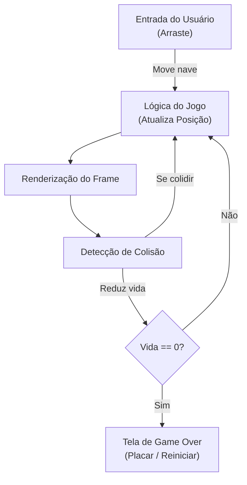

# 🚀 Órbita Zero – Projeto Final

**Disciplina:** Desenvolvimento para Dispositivos Móveis  
**Alunos:** João Victor Nogueira e Sabrina de Oliveira Souza 
**Stack:** Flutter + Git + VS Code

---

## 📋 Visão Geral

**Órbita Zero** é um jogo mobile 2D desenvolvido em **Flutter** com o motor de jogos **Flame**. O jogo simula uma nave que deve sobreviver em um cenário que rola continuamente de cima para baixo, evitando asteroides e coletando itens. O projeto aplica conceitos de desenvolvimento mobile, interação por gestos, detecção de colisões e gerenciamento de estado.

---

## ✨ Características

- Controle por gesto: arraste o dedo para mover a nave.
- Cenário com scroll automático (de cima para baixo) e velocidade constante.
- Indicador visual de vida (HP) para a nave.
- Tela de Game Over com opção de reiniciar.
- Detecção de colisões entre nave, asteroides e power-ups.
- Renderização usando Flame para performance otimizada.
- Compatível com iOS e Android (códigos nativos presentes nas pastas ios/ e android/).

---

## 🏷️ Requisitos Funcionais

- RF-01: O sistema deve permitir mover a nave arrastando o dedo.
- RF-02: O cenário deve rolar automaticamente de cima para baixo.
- RF-03: A velocidade do scroll deve ser constante.
- RF-04: A nave deve ter um indicador visual de vida na tela.
- RF-05: Ao zerar a vida, o jogo deve exibir a tela de Game Over.
- RF-06: A tela de Game Over deve permitir reiniciar a partida.

---

## 🏗️ Estrutura do Projeto

```
cosmic_havoc_trabalho_final/
├── android/              # Código nativo Android
├── ios/                  # Código nativo iOS (Swift)
├── lib/
│   ├── main.dart         # Ponto de entrada da aplicação
│   ├── models/           # Modelos (Player, Asteroid, etc.)
│   ├── screens/          # Telas do jogo (GameScreen, GameOverScreen)
│   ├── services/         # Lógica e serviços
│   └── widgets/          # Componentes reutilizáveis
├── assets/               # Imagens, sprites e sons
├── pubspec.yaml          # Dependências do Flutter
└── README.md             # Este arquivo
```

### Componentes Principais

- GameScreen: tela principal com loop de jogo e renderização.
- GameOverScreen: exibe pontuação final e ações (reiniciar/voltar ao menu).
- Player (Nave): entidade controlável pelo jogador.
- Asteroides: obstáculos com movimento descendente.
- Gerenciador de Colisão: lógica para detectar e tratar colisões.
- Gerenciador de Estado: controla transições entre menu, jogo e game over.

---

## 🔁 Fluxo do Jogo



## 📦 Como Compilar e Executar

### Pré-requisitos

- Flutter SDK instalado (https://flutter.dev)
- Xcode (para iOS) ou Android Studio (para Android)
- Emulador ou dispositivo físico conectado

### Passos

1. Clone o repositório:
   ```bash
   git clone https://github.com/s4abr1na/cosmic_havoc_trabalho_final.git
   cd cosmic_havoc_trabalho_final
   ```

2. Instale dependências:
   ```bash
   flutter pub get
   ```

3. Execute no dispositivo/emulador:
   - Android:
     ```bash
     flutter run -d android
     ```
   - iOS:
     ```bash
     flutter run -d ios
     ```

4. Durante o desenvolvimento, use hot reload:
   ```bash
   flutter run
   ```

---

## 🧪 Testes e Diagnóstico

Testes manuais recomendados:
- Movimento: arrastar a nave e verificar resposta suave.
- Colisão: forçar colisões e conferir redução de vida.
- Game Over: zerar a vida para confirmar transição de tela.
- Reinício: checar se estados são resetados ao reiniciar.

Logs e debug:
- Use `print()` ou `dart:developer` para logs.
- Use ferramentas do Flutter DevTools para inspeção de frames e memória.

---

## 📈 Performance e Otimizações

- Reutilize objetos (object pooling) para asteroides e efeitos.
- Mantenha texturas em tamanhos adequados para evitar overhead de GPU.
- Evite alocações frequentes no loop de jogo.
- Use colisões simplificadas (caixas/círculos) para reduzir custo computacional.

---

## 🐛 Limitações e Melhorias Futuras

Limitações conhecidas:
- Persistência de pontuação (highscore) não implementada.
- Ausência de trilha sonora e efeitos sonoros integrados.
- Dificuldade estática (sem progressão dinâmica).

Melhorias propostas:
- Salvar highscore localmente ou em backend (Firebase).
- Adicionar sons e música de fundo.
- Implementar níveis de dificuldade progressiva.
- Leaderboard online e suporte a múltiplos idiomas (i18n).

---

## 🧩 Documentação dos Componentes

### `main.dart` — Ponto de entrada

Arquivo responsável por inicializar o app Flutter e registrar o widget do jogo. Aqui é configurado o `GameWidget` do Flame, que exibe o jogo na tela, e também o mapa de overlays, que são as telas extras que aparecem sobre o jogo, como a tela de Game Over.

---

### `my_game.dart` — Classe principal do jogo

É o coração do projeto. Estende `FlameGame` e coordena todos os outros componentes. As principais responsabilidades são:

- **Inicializar o jogo** (`onLoad`, `startGame`): carrega o joystick, o player, o botão de disparo, os spawners de asteroides e pickups, e o placar.
- **Gerar asteroides e power-ups** (`SpawnComponent.periodRange`): usa um sistema de spawn periódico que cria novos objetos em intervalos aleatórios.
- **Controlar o placar** (`incrementScore`): atualiza o texto na tela e adiciona um efeito de "pop" visual no número.
- **Gerenciar o fim de jogo** (`playerDied`): pausa o motor e exibe o overlay de Game Over.
- **Reiniciar a partida** (`restartGame`): remove asteroides e pickups ativos, zera o placar, recria o player e retoma o motor.

**Mixins usados:**
- `HasKeyboardHandlerComponents` — permite que componentes reajam ao teclado (útil para testes no desktop/web).
- `HasCollisionDetection` — ativa o sistema de colisão do Flame para todos os componentes do jogo.

---

### `player.dart` — Nave do jogador

Representa a nave controlada pelo usuário. Estende `SpriteAnimationComponent`, o que significa que exibe uma animação de sprites em loop (dois frames da nave com o propulsor piscando).

**Movimentação:** o player lê o `relativeDelta` do joystick a cada frame e soma com qualquer input de teclado, movendo a nave na direção resultante.

**Tiro:** quando `_isShooting` é verdadeiro, um laser é criado a cada 0.2 segundos. Se o power-up de laser triplo estiver ativo (`_laserPowerupTimer`), três lasers são disparados em leque.

**Colisões tratadas:**
- Com `Asteroid`: se não tiver escudo, inicia a sequência de destruição (`_handleDestruction`), que anima a nave caindo, cria explosões aleatórias e ao final chama `game.playerDied()`.
- Com `Pickup`: coleta o item e aplica seu efeito (laser triplo, bomba ou escudo).

**Mixins usados:**
- `KeyboardHandler` — captura setas do teclado.
- `CollisionCallbacks` — detecta colisões com outros objetos.

---

### `asteroid.dart` — Asteroide

Inimigo principal do jogo. Cai de cima para baixo com velocidade e rotação aleatórias. Tem um sistema de vida (`_health`) proporcional ao seu tamanho: asteroides maiores levam mais tiros para ser destruídos.

**Comportamentos:**
- **Ao tomar dano (`takeDamage`)**: perde 1 de vida. Se ainda tiver vida, pisca em branco e sofre um leve recuo para trás (`_applyKnockback`). Se a vida zerar, concede pontos, cria uma explosão e se divide em fragmentos menores (`_splitAsteroid`).
- **Divisão**: asteroides maiores se quebram em 3 pedaços menores ao serem destruídos. Asteroides pequenos demais não se dividem.
- **Bordas da tela**: ao sair pela lateral, reaparece do outro lado (efeito wraparound).

---

### `laser.dart` — Projétil

Projétil disparado pelo jogador. Se move em linha reta para cima (ou em ângulo, se disparado como parte do laser triplo). Quando colide com um asteroide, remove a si mesmo e chama `takeDamage()` no asteroide.

---

### `bomb.dart` — Bomba (power-up)

Quando coletada, uma bomba é criada na posição da nave e expande rapidamente até cobrir boa parte da tela. Usa `SequenceEffect` para encadear animações: crescer de tamanho e diminuir a opacidade. Todo asteroide que a hitbox circular tocar durante a expansão recebe dano.

---

### `shield.dart` — Escudo (power-up)

Um componente filho adicionado diretamente ao player. Exibe um sprite circular ao redor da nave e tem sua própria hitbox. Ao colidir com um asteroide, o asteroide leva dano (em vez da nave). Depois de alguns segundos, o escudo começa a desaparecer gradualmente (`OpacityEffect`) e ao sumir de vez remove a si mesmo e limpa a referência em `player.activeShield`.

---

### `pickup.dart` — Item coletável

Representa os power-ups que caem do topo da tela. Existem três tipos definidos pelo enum `PickupType`: `bomb`, `laser` e `shield`. O sprite carregado depende do tipo (`bomb_pickup.png`, etc.). Tem um efeito de pulso (escala levemente maior e menor em loop) para chamar atenção visual.

---

### `explosion.dart` — Efeito de explosão

Componente puramente visual, sem hitbox. Cria dois efeitos ao ser instanciado: um flash circular que desaparece rapidamente e um sistema de partículas (`ParticleSystemComponent`) que se espalham em direções aleatórias. As cores variam de acordo com o tipo (`ExplosionType`): marrom/terra para `dust`, cinza para `smoke` e dourado/laranja para `fire`.

---

### `star.dart` — Estrela de fundo

Componente simples que simula o fundo estrelado se movendo. Cada estrela tem tamanho e velocidade aleatórios — estrelas maiores caem mais rápido, criando um efeito de profundidade (paralaxe simples). Quando saem pela parte de baixo, reaparecem no topo em uma posição horizontal aleatória.

---

### `shoot_button.dart` — Botão de disparo

Botão visual na tela que o jogador toca para atirar. Usa `TapCallbacks` do Flame para distinguir quando o dedo toca (`onTapDown`, inicia o tiro) e quando solta (`onTapUp` / `onTapCancel`, para o tiro). Isso cria o comportamento de tiro contínuo enquanto o botão é mantido pressionado.

---

### `game_over_overlay.dart` — Tela de Game Over

Widget Flutter (não é um componente Flame) exibido sobre o jogo quando o player morre. Usa `AnimatedOpacity` para aparecer e desaparecer suavemente. O botão "PLAY AGAIN" chama `game.restartGame()` e inicia a animação de fade-out da tela, que ao terminar remove o overlay do mapa.

---

## 🔄 Fluxo do Jogo

```
Início
  └─> Spawners criam asteroides e power-ups
        └─> Player colide com asteroide
              └─> [Sem escudo] → Destruição → Game Over overlay
              └─> [Com escudo] → Asteroide leva dano, escudo protege
        └─> Player coleta power-up
              └─> bomb  → Explode tudo na tela
              └─> laser → Laser triplo por 10 segundos  
              └─> shield → Escudo temporário
        └─> Laser acerta asteroide
              └─> [Vida > 0] → Flash + recuo + pontos
              └─> [Vida = 0] → Explosão + fragmentos + pontos
Game Over
  └─> "Play Again" → Reinicia tudo
```

---

## 🎮 Controles

| Controle | Ação |
|---|---|
| Joystick (tela) | Mover a nave |
| Botão de disparo (tela) | Atirar laser |
| Setas do teclado | Mover a nave (desktop/web) |

---

## 📚 Referências

- Flutter Documentation — https://flutter.dev/docs
- Flame Engine — https://flame-engine.org/
- Dart Language — https://dart.dev/guides
- Tutorial base usado pelos autores: https://www.youtube.com/watch?v=aNWDGLgB6PQ
