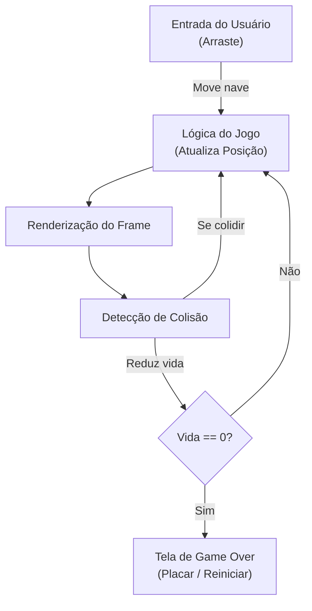

# 🚀 Órbita Zero – Projeto Final

**Disciplina:** Desenvolvimento para Dispositivos Móveis  
**Alunos:** João Victor Nogueira e Sabrina de Oliveira Souza 
**Stack:** Flutter + Git + VS Code

---

## 📋 Visão Geral

**Órbita Zero** é um jogo mobile 2D desenvolvido em **Flutter** com o motor de jogos **Flame**. O jogo simula uma nave que deve sobreviver em um cenário que rola continuamente de cima para baixo, evitando asteroides e coletando itens. O projeto aplica conceitos de desenvolvimento mobile, interação por gestos, detecção de colisões e gerenciamento de estado.

---

## ✨ Características

- Controle por gesto: arraste o dedo para mover a nave.
- Cenário com scroll automático (de cima para baixo) e velocidade constante.
- Indicador visual de vida (HP) para a nave.
- Tela de Game Over com opção de reiniciar.
- Detecção de colisões entre nave, asteroides e power-ups.
- Renderização usando Flame para performance otimizada.
- Compatível com iOS e Android (códigos nativos presentes nas pastas ios/ e android/).

---

## 🏷️ Requisitos Funcionais

- RF-01: O sistema deve permitir mover a nave arrastando o dedo.
- RF-02: O cenário deve rolar automaticamente de cima para baixo.
- RF-03: A velocidade do scroll deve ser constante.
- RF-04: A nave deve ter um indicador visual de vida na tela.
- RF-05: Ao zerar a vida, o jogo deve exibir a tela de Game Over.
- RF-06: A tela de Game Over deve permitir reiniciar a partida.

---

## 🏗️ Estrutura do Projeto

```
cosmic_havoc_trabalho_final/
├── android/              # Código nativo Android
├── ios/                  # Código nativo iOS (Swift)
├── lib/
│   ├── main.dart         # Ponto de entrada da aplicação
│   ├── models/           # Modelos (Player, Asteroid, etc.)
│   ├── screens/          # Telas do jogo (GameScreen, GameOverScreen)
│   ├── services/         # Lógica e serviços
│   └── widgets/          # Componentes reutilizáveis
├── assets/               # Imagens, sprites e sons
├── pubspec.yaml          # Dependências do Flutter
└── README.md             # Este arquivo
```

### Componentes Principais

- GameScreen: tela principal com loop de jogo e renderização.
- GameOverScreen: exibe pontuação final e ações (reiniciar/voltar ao menu).
- Player (Nave): entidade controlável pelo jogador.
- Asteroides: obstáculos com movimento descendente.
- Gerenciador de Colisão: lógica para detectar e tratar colisões.
- Gerenciador de Estado: controla transições entre menu, jogo e game over.

---

## 🔁 Fluxo do Jogo



## 📦 Como Compilar e Executar

### Pré-requisitos

- Flutter SDK instalado (https://flutter.dev)
- Xcode (para iOS) ou Android Studio (para Android)
- Emulador ou dispositivo físico conectado

### Passos

1. Clone o repositório:
   ```bash
   git clone https://github.com/s4abr1na/cosmic_havoc_trabalho_final.git
   cd cosmic_havoc_trabalho_final
   ```

2. Instale dependências:
   ```bash
   flutter pub get
   ```

3. Execute no dispositivo/emulador:
   - Android:
     ```bash
     flutter run -d android
     ```
   - iOS:
     ```bash
     flutter run -d ios
     ```

4. Durante o desenvolvimento, use hot reload:
   ```bash
   flutter run
   ```

---

## 🧪 Testes e Diagnóstico

Testes manuais recomendados:
- Movimento: arrastar a nave e verificar resposta suave.
- Colisão: forçar colisões e conferir redução de vida.
- Game Over: zerar a vida para confirmar transição de tela.
- Reinício: checar se estados são resetados ao reiniciar.

Logs e debug:
- Use `print()` ou `dart:developer` para logs.
- Use ferramentas do Flutter DevTools para inspeção de frames e memória.

---

## 📈 Performance e Otimizações

- Reutilize objetos (object pooling) para asteroides e efeitos.
- Mantenha texturas em tamanhos adequados para evitar overhead de GPU.
- Evite alocações frequentes no loop de jogo.
- Use colisões simplificadas (caixas/círculos) para reduzir custo computacional.

---

## 🐛 Limitações e Melhorias Futuras

Limitações conhecidas:
- Persistência de pontuação (highscore) não implementada.
- Ausência de trilha sonora e efeitos sonoros integrados.
- Dificuldade estática (sem progressão dinâmica).

Melhorias propostas:
- Salvar highscore localmente ou em backend (Firebase).
- Adicionar sons e música de fundo.
- Implementar níveis de dificuldade progressiva.
- Leaderboard online e suporte a múltiplos idiomas (i18n).

---

## 📚 Referências

- Flutter Documentation — https://flutter.dev/docs
- Flame Engine — https://flame-engine.org/
- Dart Language — https://dart.dev/guides
- Tutorial base usado pelos autores: https://www.youtube.com/watch?v=aNWDGLgB6PQ

---
